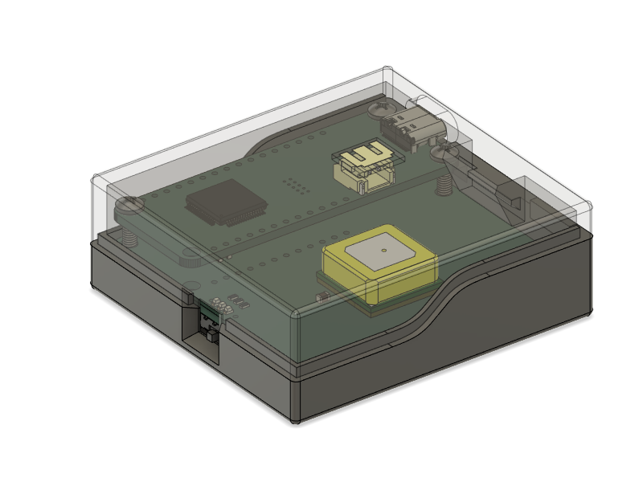

# Tempo

### Experiments in audible feedback for skydivers.

This project is designed to experiment with real-time audible feedback to a skydiver in freefall. The original Peakick design stacks a [SparkFun ESP32 Thing Plus](https://github.com/sparkfun/STM32_Thing_Plus) atop a custom GNSS/sensor combo board. The SparkFun board supports an audio connection to Bluetooth earbuds or headphones.

That design was subsequently replaced with a stand-alone "Tempo" board, which has the same
sensors, but adds an integrated SAMD51 MCU.

### Sensors and Capabilites

- GPS/GNSS via u-blox SAM-M10Q
- 6-DOF Inertial measurement / gyro via ICM-42688-V
- Barometric pressure / temperature via BPM390
- 3-DOF Compass/Magnetic measurement via MMC5983
- Bluetooth audio output (Peakick assembly only; to be added)

I am just getting started with this project, so all I'm doing for now is velidating the sensor board designs and (soon) experimenting with basic BT audio capabilities.

## Directory Structure

| Folder      | Description |
| ----------- | ----------- |
| hardware    | KiCad PCB projects (using KiCad 7)    |
| hardware/peakick | (original) u-blox GNSS + IMU + Barometric sensor PCB |
| hardware/tempo |(newer design)  SAMD51 + u-blox GNSS + IMU + Barometric sensor PCB |
| enclosure    | 3D-printable enclosure (Fusion360 format)
| firmware    | Arduino sketches       |
| platformio  | Platformio test and operational projects for Tempo board |

## Enclosure

The enclosure is designed to be SLA printable. I print using a MakerBot Replicator 2 with Cura 5.3.1 as the slicer. Print resolution set to 0.15mm.

The PCBs are secured to the enclosure using M2.5 brass inserts and screws. The inserts are heat-inserted into the bottom shell using a soldering iron after printing.

### PCB Notes

This board was created using KiCad 7.0.  In order to get the header alignment between the two board as acccurate as possible, I imported the [SparkFun STM32 Thing Plus](https://github.com/sparkfun/STM32_Thing_Plus) GitHub project to use its PCB layout. 

I prefer 1 oz. Copper with ENIG finish. I ordered the V1 PCB from OSHPark and stencils from OSH as well.

## Peakick Assembly Parts List

| QTY | MPN      | Description |
|----| ----------- | ----------- |
| 1 | [WRL-15663](https://www.digikey.com/en/products/detail/sparkfun-electronics/WRL-15663/11506265)   | SparkFun ESP32 Thing Plus WROOM
| 1 | N/A   | peakick PCB assembly
| 3  |       | 6 POS 5mm 0.10" receptacle (soldered to peakick PCB)
| 3  |       | 6 POS 0.10" headers
| 1 | [1578](https://www.digikey.com/en/products/detail/adafruit-industries-llc/1578/5054539?utm_adgroup=Battery%20Products&utm_source=google&utm_medium=cpc&utm_campaign=Dynamic%20Search_EN_RLSA_Buyers&utm_term=&utm_content=Battery%20Products&utm_id=go_cmp-175054755_adg-15264279675_ad-399492818526_aud-505192123430:dsa-53357708014_dev-c_ext-_prd-_sig-Cj0KCQjwm66pBhDQARIsALIR2zAggpxuq8dQv4im2FGo1CqTU3N75aE9USMP6jGWoU6Vr5h_xDsHwy8aAp_DEALw_wcB&gclid=Cj0KCQjwm66pBhDQARIsALIR2zAggpxuq8dQv4im2FGo1CqTU3N75aE9USMP6jGWoU6Vr5h_xDsHwy8aAp_DEALw_wcB) | Adafruit 3.7V 500mAH LiPoly rechargeable battery
| 3 | [1GNL7](https://www.grainger.com/product/GRAINGER-APPROVED-Heat-Set-Insert-M2-5-0-45-1GNL7) | Grainger M2.5 Brass Inserts
| 3 |       | M2.5 x 16 mm phillips screws
| 1 | N/A   | Project enclosure (Top and bottom shells)

The two boards are interconnected using 0.1" headers and receptacles. The header/receptacle parts were selected to minimize the gap between the two boards and still allow for quick interchange of each board when required. Nylon spacers are used with each of the mounting screws to minimize the effect of shock and vibration in the electrical interconnections.