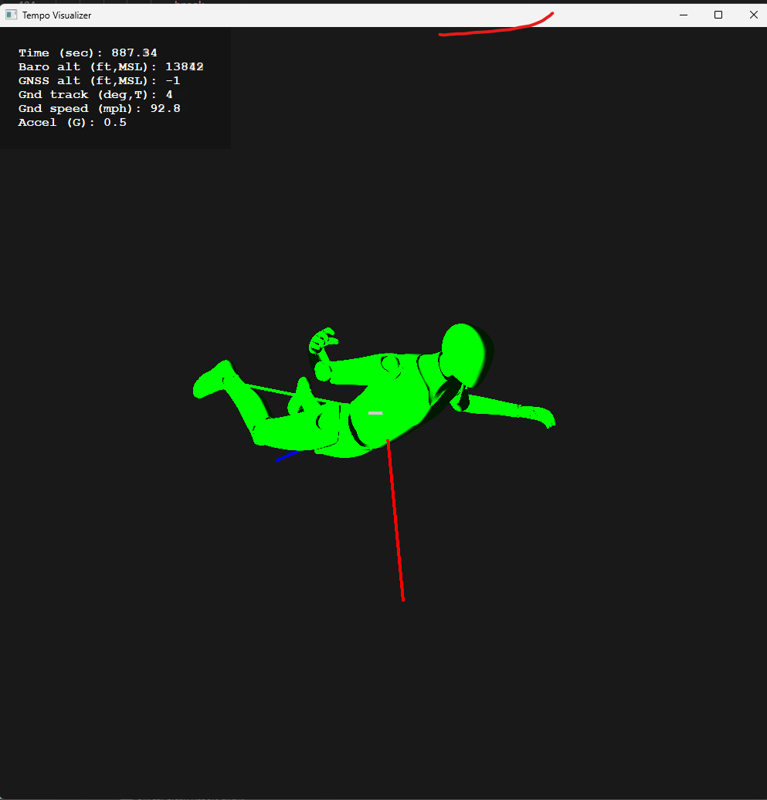

# The pose-visualizer Application

The pose-visualizer application is designed to provide direct visualization of a jump log file generated by the tempo device.

```
$ python pose-visualizer.py <path-to-jump-log-file>
```




### Uses Python 3.9.13 for development

### Configuring Python to run pose-visualizer

To be added,

### Log File Format

The log file format is documented as part of the original Dropkick project. Have a look the documentation in [LOG-FORMAT.md](https://github.com/rrainey/dropkick/blob/main/LOG-FORMAT.md)

### Credits

The articulated 3D Human model used to represent the skydiver in this application was derived from [this GrabCAD model](https://grabcad.com/library/human-body-model-joints-for-fusion360-1). The original Fusion 360 model can be downloaded from that site.