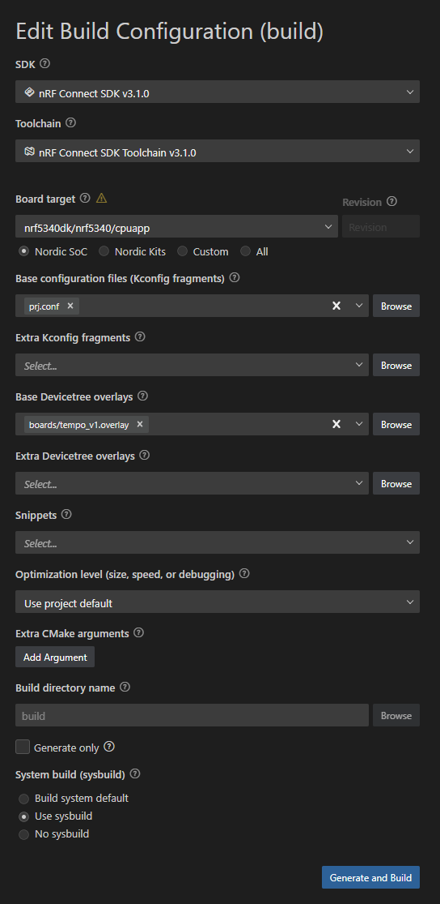

# Tempo-BT - A Skydiving Data Logger

A Zephyr RTOS-based flight data logging system for the nRF5340 platform, designed for capturing high-frequency sensor data during skydiving and other aerial activities. The system logs IMU, barometric, GPS, and optional magnetometer data to SD card or internal flash storage, with Bluetooth LE connectivity for wireless data transfer and configuration.

## Table of Contents

- [Features](#features)
- [Hardware Requirements](#hardware-requirements)
- [Software Prerequisites](#software-prerequisites)
- [Build Instructions](#build-instructions)
- [Configuration](#configuration)
- [Usage Examples](#usage-examples)
- [Data Format](#data-format)
- [LED Status Indicators](#led-status-indicators)
- [Troubleshooting](#troubleshooting)
- [License](#license)
- [Support](#support)

## Features

- **Runs on the [Tempo-BT V1 Board](../../hardware/tempo-bt)**
  - open source hardware design
  - part of this GitHub repository

- **High-frequency sensor logging**
  - 40 Hz IMU data (TDK InvenSense ICM-42688-V)
  - 4 Hz barometric pressure/temperature (Bosch BMP390)
  - 2-10 Hz GPS (u-blox SAM-M10Q)
  - Optional magnetometer support (MMC5983MA)
  
- **Flexible storage options**
  - Primary: SD card via SPI (exFAT support)
  - Fallback: Internal QSPI flash (littlefs)
  - Automatic storage detection at boot
  
- **Wireless connectivity**
  - Bluetooth LE with mcumgr protocol
  - File transfer over BLE (100-200 KB/s)
  - Remote configuration and control
  - OTA firmware updates
  
- **Intelligent flight detection**
  - Automatic arming/disarming
  - State machine with flight phase detection
  - Configurable trigger thresholds

## Hardware Requirements

- **Development Board**: nRF5340 DK or custom Tempo-BT V1 board
- **Sensors** (connected as per hardware documentation):
  - ICM-42688-V IMU (SPI)
  - BMP390 Barometer (I²C)
  - SAM-M10Q GNSS module (UART)
  - Optional: MMC5983MA Magnetometer (I²C)
- **Storage**: SD card (recommended) or internal 8MB QSPI flash

## Software Prerequisites

### Development Environment

1. **Visual Studio Code**
   - Download and install from [https://code.visualstudio.com/](https://code.visualstudio.com/)

2. **nRF Connect SDK v3.1.0**
   - Install the nRF Connect for VS Code extension
   - Use the extension to install nRF Connect SDK v3.1.0
   - Ensure toolchain v3.1.0 is selected

3. **Additional Tools**
   - Python 3.8 or higher
   - Git
   - mcumgr CLI tool (for device interaction; mcumgr can be built from source)

### VS Code Configuration

Configure your build in VS Code using these settings:



Key configuration points:
- **SDK**: nRF Connect SDK v3.1.0
- **Toolchain**: nRF Connect SDK Toolchain v3.1.0
- **Board target**: nrf5340dk/nrf5340/cpuapp
- **Base configuration**: prj.conf
- **Device tree overlay**: boards/tempo_v1.overlay

## Build Instructions

### 1. Clone the Repository

```bash
git clone https://github.com/rrainey/tempo
cd tempo/zephyr/tempo-bt-v1
```

### 2. Open in VS Code

```bash
code .
```

### 3. Build the Project

Using VS Code:
1. Open the nRF Connect extension sidebar
2. Click "Add Build Configuration"
3. Select the settings as shown in the configuration image above
4. Click "Generate and Build"

Using Command Line:
```bash
west build -b nrf5340dk_nrf5340_cpuapp -p auto
```

### 4. Flash the Firmware

Using VS Code:
- Click the "Flash" button in the nRF Connect extension

Using Command Line:
```bash
west flash
```

## Configuration

### Project Configuration (prj.conf)

Key configuration options:
```conf
# Storage backend
CONFIG_SD_CARD_SUPPORT=y      # Enable SD card
CONFIG_USE_INTERNAL_FLASH=n   # Use SD card as primary

# Sensor rates
CONFIG_IMU_SAMPLE_RATE_HZ=200
CONFIG_BARO_SAMPLE_RATE_HZ=50
CONFIG_GNSS_RATE_HZ=2

# BLE settings
CONFIG_BT_DEVICE_NAME="Tempo-BT"
```

### Runtime Configuration

Many settings can be changed at runtime via mcumgr:
- Logging thresholds
- Sensor sample rates
- Auto-arm parameters

## Usage Examples

### Connecting via Bluetooth

We use [`mcumgr`](https://github.com/apache/mynewt-mcumgr) for testing the Bluetooth interfaces.  This software runs on Mac and Linux systems.  We can also use the nRF Connect mobile apps for some forms of tests.

1. **Find the device**:
```bash
mcumgr --conntype ble --connstring ctlr_name=hci0 conn find
```

2. **Test connection**:
```bash
mcumgr --conntype ble --connstring peer_name='Tempo-BT' echo hello
```

### File Operations

1. **List logged sessions**:
```bash
mcumgr --conntype ble --connstring peer_name='Tempo-BT' fs ls /logs
```

2. **Download a log file**:
```bash
mcumgr --conntype ble --connstring peer_name='Tempo-BT' fs download /logs/20250117/12345678/flight.txt flight.txt
```

3. **Delete a log file**:
```bash
mcumgr --conntype ble --connstring peer_name='Tempo-BT' fs delete /logs/20250117/12345678/flight.txt
```

Within this example path, `20250117` corresponds to the calendar date of the jump (`YYYMMDD`). `12345678` is a pseudo-random number assigned to each jump in that directory. The actual flight log will always be named `flight.txt`.

### Device Control

1. **Get device status**:
```bash
mcumgr --conntype ble --connstring peer_name='Tempo-BT' stat list
```

2. **Get storage information**:
```bash
mcumgr --conntype ble --connstring peer_name='Tempo-BT' custom storage_info -g 64
```

### Non-volatile Device Configuration Control

The device maintains several persistent settings that can be queried and modified over Bluetooth using mcumgr's config commands.

#### Available Settings

| Setting | Description | Type | Default |
|---------|-------------|------|---------|
| `app/ble_name` | Bluetooth device name | String (max 31 chars) | "TempoBT" |
| `app/user_uuid` | User identifier UUID | UUID (128-bit) | Auto-generated on first boot |
| `app/device_uuid` | Device identifier UUID | UUID (128-bit) | Auto-generated on first boot |
| `app/log_backend` | Storage backend type | String | "littlefs" |
| `app/pps_enabled` | PPS time sync enabled | Boolean | false (V1 hardware) |

#### Reading Settings

To read a specific setting:
```bash
# Read device name
mcumgr --conntype ble --connstring peer_name='Tempo-BT' config app/ble_name

# Read user UUID
mcumgr --conntype ble --connstring peer_name='Tempo-BT' config app/user_uuid

# Read device UUID
mcumgr --conntype ble --connstring peer_name='Tempo-BT' config app/device_uuid

# Read storage backend
mcumgr --conntype ble --connstring peer_name='Tempo-BT' config app/log_backend
```

#### Writing Settings

To modify a setting:
```bash
# Change device name
mcumgr --conntype ble --connstring peer_name='Tempo-BT' config app/ble_name set "MyTempo"

# Set storage backend (choose "littlefs" or "fatfs")
mcumgr --conntype ble --connstring peer_name='Tempo-BT' config app/log_backend set "fatfs"

# Note: UUIDs are typically not changed after initial generation, but can be set if needed
# Format: UUID must be provided as a 32-character hex string (no dashes)
mcumgr --conntype ble --connstring peer_name='Tempo-BT' config app/user_uuid set "550e8400e29b41d4a716446655440000"
```

#### Viewing All Settings

To see all current settings at once:
```bash
# List all settings under the "app" namespace
mcumgr --conntype ble --connstring peer_name='Tempo-BT' config app
```

#### Notes on UUIDs

- Both `user_uuid` and `device_uuid` are automatically generated on first boot
- UUIDs are version 4 (random) format
- The `user_uuid` is intended to identify the person using the device
- The `device_uuid` uniquely identifies this specific hardware unit
- UUIDs are displayed in standard format (e.g., `550e8400-e29b-41d4-a716-446655440000`)
- When setting UUIDs via mcumgr, provide them as 32 hex characters without dashes

#### Persistence

All settings are stored in non-volatile memory and persist across power cycles and firmware updates.


This revised section provides comprehensive documentation for all available settings, including examples of how to read and write each one using mcumgr commands.

### Manual Control

The device can also be controlled via the onboard button:
- **Short press**: Start/stop logging (when armed)
- **Long press (3s)**: Arm/disarm the logger

## Data Format

Log files are in extended NMEA sentence format with NMEA-style checksums. Key sentence types:

- `$PVER`: Version and metadata
- `$PIMU`: IMU data (40 Hz)
- `$PIM2`: Quaternion orientation
- `$PENV`: Environmental data (pressure, temperature)
- `$PFIX`: GPS fix information
- `$PST`: State changes
- `$PMAG`: Magnetometer data (optional)
- `$GNGGL` : Fix, from u-blox receiver
- `$GNVTG` : track made good, from u-blox receiver
- `$GNGGA` : Fix, from u-blox receiver

Example log excerpt:
```
$PVER,1.0,V1,0.1.0,2025-01-15*AB
$PSFC,880*1C
$PST,1000,IDLE,ARMED,USER*5D
$PIMU,1001,9.81,0.02,-0.15,0.001,0.002,0.003*2F
$PIM2,1001,1.0000,0.0000,0.0000,0.0000*A1
```

## LED Status Indicators

The RGB LED provides visual system status:

| Color | Pattern | State |
|-------|---------|-------|
| Blue | Slow pulse | IDLE - Ready |
| Green | Slow pulse | ARMED - Waiting for trigger |
| Red | Fast flash | LOGGING - Recording data |
| Yellow | Solid | File transfer active |
| Magenta | Slow flash | Error state |

## Troubleshooting

### Common Issues

1. **Device not visible over Bluetooth**
   - Ensure the device is powered on
   - Check that Bluetooth is enabled on your computer
   - Try resetting the device

2. **SD card not detected**
   - Verify card is properly inserted
   - Ensure card is formatted as exFAT
   - Check for supported card size (max 32GB recommended)

3. **mcumgr connection fails**
   - Update mcumgr to latest version
   - Check Bluetooth adapter compatibility
   - Try shorter connection intervals

### Debug Output

Connect via RTT to see debug messages:
```bash
JLinkRTTViewer
```

## License

This project is licensed under the Apache License 2.0. See the [LICENSE](LICENSE) file for details.

```
Copyright 2025 Tempo-BT Contributors

Licensed under the Apache License, Version 2.0 (the "License");
you may not use this file except in compliance with the License.
You may obtain a copy of the License at

    http://www.apache.org/licenses/LICENSE-2.0

Unless required by applicable law or agreed to in writing, software
distributed under the License is distributed on an "AS IS" BASIS,
WITHOUT WARRANTIES OR CONDITIONS OF ANY KIND, either express or implied.
See the License for the specific language governing permissions and
limitations under the License.
```

## Support

For questions, bug reports, or feature requests:

- **Primary Contact**: Riley Rainey ([@rileyrainey](https://x.com/rileyrainey) on X.com)
- **Issues**: Please file issues on the project's GitHub repository
- **Documentation**: Additional documentation can be found in the `docs/` directory

### Contributing

Contributions are welcome!