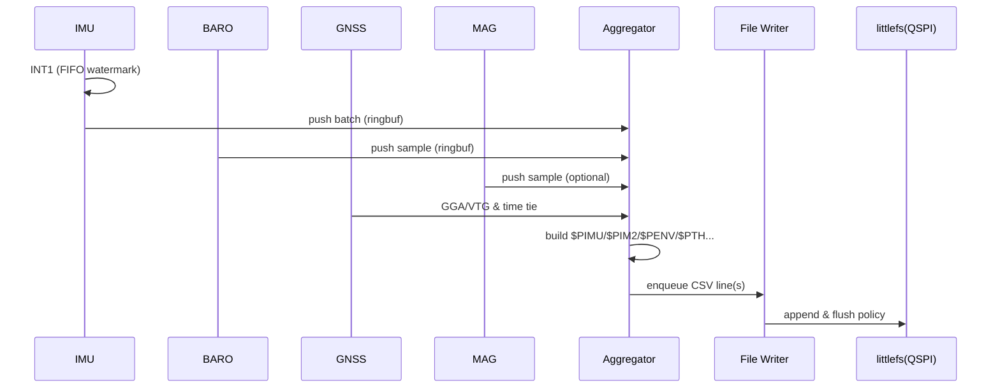
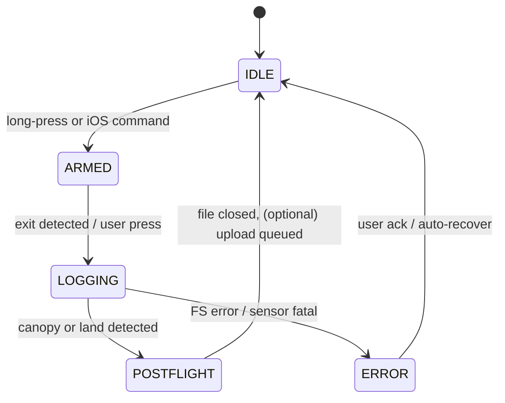

# Tempo-BT (V1) — Zephyr Device Application Architecture

> Scope: architecture for the **V1 prototype** (nRF5340 / NORA-B106) with ICM-42688-V (SPI), BMP390 (I²C), optional MMC5983MA (I²C), u-blox SAM-M10Q (UART), **QSPI NOR** (littlefs).
> Focus areas per request:
>
> 1. **File + folder (project) structure**
> 2. **What each part does**
> 3. **Where state lives & how services connect**

---

## 1) Project Layout (top-level folders and key files)

```
tempo-bt/
├─ CMakeLists.txt                # Zephyr app build entry
├─ prj.conf                      # Kconfig: features, stacks, logging, BLE, FS
├─ Kconfig                       # (optional) app-specific config symbols
├─ west.yml                      # (optional) NCS/Zephyr manifest pinning
│
├─ boards/
│  └─ nrf5340dk_nrf5340/
│     ├─ tempo_v1.overlay        # DeviceTree overlay: pins/buses/IRQs for V1
│     └─ tempo_v1.conf           # Board-specific prj.conf deltas (if needed)
│
├─ include/
│  ├─ app/app_state.h            # System/session state structs & enums
│  ├─ app/events.h               # Event IDs, payloads, and helper macros
│  ├─ app/log_format.h           # $Pxxx sentence format & helpers (CSV/NMEA)
│  ├─ app/paths.h                # FS paths, naming & partition IDs
│  │
│  ├─ services/timebase.h        # Time service API (monotonic, GNSS tie)
│  ├─ services/imu.h             # ICM42688 sample structs & API
│  ├─ services/baro.h            # BMP390 sample structs & API
│  ├─ services/mag.h             # MMC5983MA sample structs & API (optional)
│  ├─ services/gnss.h            # GNSS NMEA/UBX ingest API
│  ├─ services/aggregator.h      # Merges streams → record/sentence builder
│  ├─ services/logger.h          # Logging session lifecycle & policies
│  ├─ services/file_writer.h     # Async writer (CSV line | binary block)
│  ├─ services/storage.h         # ILogSink abstraction (littlefs/FATFS)
│  ├─ services/upload.h          # mcumgr/SMP file ops facade
│  ├─ services/dfu.h             # OTA (MCUboot) helpers
│  │
│  └─ util/ringbuf.h             # Lock-free buffers, pool allocs, CRC helpers
│
├─ src/
│  ├─ main.c                     # Init order, threads, event loop, health
│  ├─ app_init.c                 # Boards, drivers, settings, services bring-up
│  ├─ app_state.c                # State container & atomic transitions
│  ├─ events.c                   # Event bus (k_fifo/k_msgq) + subscribers
│  │
│  ├─ services/
│  │  ├─ timebase.c             # 64-bit mono clock; GNSS time correlation
│  │  ├─ imu_icm42688.c         # SPI4 + INT1/FIFO DMA; ODR control
│  │  ├─ baro_bmp390.c          # I²C + DRDY; pressure/temperature
│  │  ├─ mag_mmc5983ma.c        # I²C + INT; optional
│  │  ├─ gnss_m10q.c            # UART DMA; NMEA/UBX parse; `$PTH` hooks
│  │  ├─ aggregator.c           # Streams → `$PIMU/$PIM2/$PENV/...` w/ checksums
│  │  ├─ logger.c               # Session mgmt; start/stop; rate schedules
│  │  ├─ file_writer.c          # Background I/O; flush; backpressure
│  │  ├─ storage_littlefs.c     # QSPI NOR backend (default for V1)
│  │  ├─ storage_fatfs.c        # SD/FAT backend (compiled-in optional)
│  │  ├─ upload_mcumgr.c        # FS mgmt facade for iOS client
│  │  └─ dfu.c                  # Image mgmt helpers (SMP + MCUboot)
│  │
│  ├─ drivers/                   # Shims for any out-of-tree sensors (if needed)
│  │  ├─ icm42688_shim.c
│  │  └─ mmc5983ma_driver.c
│  │
│  └─ util/
│     ├─ ringbuf.c
│     └─ crc32.c
│
├─ config/
│  ├─ settings.c                 # Zephyr settings keys & defaults (`app/*`)
│  └─ partitions.yml             # Flash partitions (mcuboot, littlefs, etc.)
│
├─ subsys/
│  └─ event_bus/
│     ├─ event_bus.h             # Light wrapper over k_fifo/k_msgq
│     └─ event_bus.c
│
├─ samples/                      # (Optional) Narrow demos (e.g., “log-to-qspi”)
├─ tests/                        # Unit/integration (ztest) + hardware smoke tests
└─ scripts/
   ├─ gen_version.py             # Embed git/semver into $PVER
   └─ host_tools/verify_log.py   # PC-side log validator
```

---

## 2) DeviceTree Overlay (V1 essentials) & Build Config

**`boards/nrf5340dk_nrf5340/tempo_v1.overlay` (illustrative)**

```dts
/* QSPI NOR — MX25R64, littlefs target */
&qspi {
    status = "okay";
    pinctrl-0 = <&qspi_default>;
    label = "qspi_nor";
    mx25r64: mx25r6435f@0 {
        compatible = "jedec,spi-nor";
        reg = <0>;
        /* Quad mode enabled by driver; pins are fixed to the nRF QSPI pads */
    };
};

/* ICM-42688-V on SPIM4 + INT1 on P1.07 (D6) */
&spi4 {
    status = "okay";
    icm42688@0 {
        compatible = "invensense,icm42688";
        reg = <0>;
        spi-max-frequency = <32000000>;
        cs-gpios = <&gpio0 11 GPIO_ACTIVE_LOW>;
        int1-gpios = <&gpio1 7 GPIO_ACTIVE_HIGH>;
        label = "ICM42688";
    };
}

/* BMP390 + MMC5983MA on I2C bus P1.02/1.03; DRDY IRQs on D11/D9 */
&i2c0 {
    status = "okay";
    bmp390@76 {
        compatible = "bosch,bmp3";
        reg = <0x76>;
        int-gpios = <&gpio1 11 GPIO_ACTIVE_HIGH>;
        label = "BMP390";
    };
    mmc5983@30 {
        compatible = "memsic,mmc5983ma";
        reg = <0x30>;
        int-gpios = <&gpio1 9 GPIO_ACTIVE_HIGH>;
        label = "MMC5983MA";
    };
}

/* GNSS on selected UART (choose one assembly path) */
&uart2 { status = "okay";  /* SAM-M10Q */ };
&uart3 { status = "disabled"; };
```

**`prj.conf` (highlights)**

```conf
# BLE + SMP (file xfer) + DFU
CONFIG_BT=y
CONFIG_BT_PERIPHERAL=y
CONFIG_MCUMGR=y
CONFIG_MCUMGR_SMP_BT=y
CONFIG_FS_MGMT=y
CONFIG_IMG_MANAGER=y
CONFIG_BOOTLOADER_MCUBOOT=y

# Filesystems & storage
CONFIG_FILE_SYSTEM=y
CONFIG_FS_LITTLEFS=y
CONFIG_FLASH=y
CONFIG_NVS=y
CONFIG_DISK_ACCESS=y
# (Optional) FATFS if SD present on future revs:
# CONFIG_FAT_FILESYSTEM_ELM=y

# Drivers
CONFIG_SENSOR=y
CONFIG_I2C=y
CONFIG_SPI=y
CONFIG_UART_ASYNC_API=y
CONFIG_NRFX_QSPI=y

# RTOS & debug
CONFIG_MAIN_STACK_SIZE=4096
CONFIG_HEAP_MEM_POOL_SIZE=8192
CONFIG_LOG=y
CONFIG_LOG_BACKEND_RTT=y
CONFIG_PM_DEVICE=y
```

---

## 3) Runtime Architecture (what each part does)

### 3.1 Layered view

```mermaid
flowchart TB
  subgraph App["Application"]
    UI[Buttons/LEDs\n(minimal)] --> Logger
    Logger[Logger Service\n(session state machine)]
    Upload[Upload Service\n(mcumgr FS + DFU)]
  end

  subgraph Services
    Agg[Aggregator\n(sentence builder + rates)]
    Writer[File Writer\n(async flush, CRC)]
    Tm[Timebase\n(64-bit mono + GNSS tie)]
  end

  subgraph Drivers["Sensor + IO Drivers"]
    IMU[ICM42688 (SPI4 + INT1)]
    BARO[BMP390 (I²C + DRDY)]
    MAG[MMC5983MA (I²C + INT)]
    GNSS[GNSS (UART DMA)]
    QSPI[QSPI NOR (littlefs)]
  end

  App --> Agg
  IMU --> Agg
  BARO --> Agg
  MAG --> Agg
  GNSS --> Agg
  Tm --> Agg

  Agg --> Writer --> QSPI

  App --> Upload --> QSPI
```

### 3.2 Concurrency model (threads & priorities)

* **IMU thread (high)**: handles SPI burst reads on FIFO/INT1; batches samples.
* **BARO thread (med)**: handles DRDY; compensates & outputs pressure/temp.
* **MAG thread (med, optional)**: magnetometer sampling on INT/timer.
* **GNSS thread (med)**: UART DMA; parses NMEA/UBX; pushes GGA/VTG; triggers `$PTH`.
* **Aggregator (med/low)**: merges newest batches → constructs `$PIMU`, `$PIM2`, `$PENV`, `$PTH`, `$PST`, `$PSFC`, `$PVER` lines per spec; computes NMEA checksums.
* **File writer (low)**: rate-limited appender to littlefs; handles backpressure.
* **mcumgr/BT**: Zephyr’s SMP runs in its own work context; our **Upload** facade maps app paths → FS mgmt.

**Communication primitives**

* **Lock-free ring buffers** per producer (IMU/BARO/MAG/GNSS) → Aggregator.
* **Event bus** (thin wrapper over `k_fifo` or `k_msgq`) for cross-cutting events (session start/stop, errors, storage status, phase transitions).
* **Atomic flags** in `app_state` for fast “should sample?” checks.

---

## 4) Where State Lives

### 4.1 Persistent configuration (NVS / `settings`)

* Stored via Zephyr `settings` in internal flash.
* Keys (examples):

  * `app/ble_name`, `app/unit_system`
  * `app/imu_odr`, `app/baro_rate`, `app/mag_rate`
  * `app/log_backend` = `littlefs` | `fatfs`
  * `app/gnss_rate_hz` (NMEA)
  * `app/pps_enabled` (V1 = 0; V2 enables)
* Loader in `config/settings.c`; defaults compiled from Kconfig symbols.

### 4.2 System state (RAM, owned by `app_state`)

* **Global `system_state_t`** (singleton) with atomics/mutex for:

  * `mode`: `IDLE` → `ARMED` → `LOGGING` → `POSTFLIGHT` → `ERROR`
  * **health**: storage free %, battery (placeholder on V1), BLE bonded, GNSS fix state
  * **flags**: pps\_locked (false on V1), upload\_active, dfu\_in\_progress
* **Per-service caches**:

  * **IMU cache**: last calibrated gyro/accel vectors, FIFO watermarks.
  * **BARO cache**: last pressure/temp & altitude estimate.
  * **MAG cache** (optional): last B-field µT.
  * **GNSS cache**: last fix (LLA, v/acc), RTC offset to monotonic.
* **Session state (`session_state_t`)** (lifetime = active logging session):

  * `uuid`, `start_monotonic_us`, `start_utc` (from GNSS when available)
  * `rates` (effective ODRs), version, axis conventions
  * **file handles**: primary log file, (optional) sidecars (index, health)
  * rolling counters: lines\_written, bytes\_written, dropped\_samples

### 4.3 Filesystem state

* **littlefs mount** on QSPI NOR (always V1).
* Path scheme:
  `"/lfs/logs/<YYYYMMDD>/<SESSION_UUID>/flight.csv"`
  Optional sidecar: `"index.json"` (seek map) or `"health.json"` (drop counts).

---

## 5) Services — Responsibilities & Interfaces

### 5.1 `timebase`

* Provides `time_now_us()` (64-bit monotonic).
* Maintains GNSS correlation (no PPS on V1): updated by GNSS sentences; exposes `utc_from_mono()` estimation used by `$PTH`.
* Swap-in PPS discipline in V2 without changing API.

### 5.2 `imu_icm42688`

* Configures ODR, full-scale ranges; enables FIFO + INT1.
* SPI EasyDMA bursts on INT; calibrates & enqueues batches to ring buffer.
* Exposes control hooks (`imu_set_mode()`) for **phase-aware rates**.

### 5.3 `baro_bmp390`

* Configures ODR; fires on DRDY IRQ or timer fallback.
* Outputs pressure & sensor temperature; basic altitude estimate.

### 5.4 `mag_mmc5983ma` (optional)

* Periodic or INT-driven sampling; soft-iron calibration deferred (host/offline).

### 5.5 `gnss_m10q`

* UART DMA reader; NMEA line framing; optional UBX for accuracy/velocity.
* Publishes fixes; updates **timebase** correlation; triggers `$PTH` emission cadence.

###E 5.5 GNSS Service - Dynamic Rates

* **Default**: 2 Hz (ground/climb)
* **Freefall**: 10 Hz during LOGGING state
* **Auto-adjustment**: Based on flight phase
* **Buffer sizing**: 32 samples to handle rate bursts

### 5.6 `aggregator`

* Pulls newest batches from IMU/BARO/MAG/GNSS.
* Builds **CSV `$Pxxx` sentences** exactly per V1 spec (with `*HH` checksums):

  * `$PVER` (on start), `$PSFC` (session file config),
  * `$PIMU` (40 Hz), `$PIM2` (quaternion after each `$PIMU`),
  * `$PENV` (4 Hz), `$PTH` (after each GGA/VTG), `$PST` (state changes),
  * `$PMAG` (optional) if magnetometer enabled.
* Emits lines to **File Writer** queue.

### 5.7 `logger`

* Orchestrates session lifecycle: **start/stop**, file open/close, header emit.
* Chooses **rate schedule** per phase (aircraft/climbout/freefall/canopy).
* Applies **backpressure policy** (e.g., drop GNSS first if storage stalls).
* Notifies **Upload** when a session is completed (optional auto-upload).

### 5.8 `file_writer`

* Dedicated thread; drains sentence queue to append to active file.
* Write coalescing (e.g., 1–4 KB) and timed flushes; tracks FS errors and signals `logger` on failure; ensures sync on session stop.

### 5.9 Storage Backends

* **Primary**: SD Card via SPI when available (exFAT support)
* **Fallback**: Internal QSPI flash with littlefs
* **Auto-detection**: System checks for SD card at boot
* **Path abstraction**: `/logs/` maps to active storage

### 5.10 `upload_mcumgr`

* Exposes **file list/get/delete** over BLE SMP (FS mgmt group).
* Optional “virtual folder” namespacing to keep iOS client simple.
* Shares file locks with `file_writer` to avoid concurrent writes.

### 5.11 `dfu`

* MCUboot image mgmt over SMP, gated by state (not during active logging).
* Raises events for UI feedback (LED blinks, etc.).

### 5.12 Custom mcumgr Commands (Group ID: 64)

Beyond standard mcumgr file/image/OS management, Tempo-BT implements custom commands:

* **Session List** (ID: 0): Returns JSON array of logging sessions with metadata
* **Session Info** (ID: 1): Detailed info about a specific session
* **Storage Info** (ID: 2): Storage statistics and health

All commands use CBOR encoding per mcumgr standards.

### 5.13 LED Service

RGB LED provides system status:
- **Blue pulse**: IDLE
- **Green pulse**: ARMED  
- **Red fast**: LOGGING
- **Yellow**: File transfer active
- **Magenta**: Error state

---

## 6) How Services Connect

### 6.1 Data plane (samples → sentences → storage)



### 6.2 Control plane (events & state)

* `events.c` exposes `event_bus_publish(evt)` and subscriber registration.
* Producers: **logger**, **file\_writer**, **storage**, **dfu**, **upload**, **gnss**.
* Consumers: **app\_state**, **aggregator** (for `$PST`), **UI**.

**Typical events**

* `EVT_SESSION_START/STOP`, `EVT_PHASE_CHANGE`,
* `EVT_STORAGE_LOW`, `EVT_STORAGE_ERROR`,
* `EVT_UPLOAD_START/DONE`, `EVT_DFU_START/DONE`.

---

## 7) Session Lifecycle (state machine)



Arming Methods:
- Manual: Long button press or BLE command
- Auto: Takeoff detection (altitude/acceleration threshold)

Transitions emit `$PST` records with trigger reasons.

---

## 8) Logging Format Strategy (compatibility first)

* Preserve **existing CSV + NMEA checksum** `$Pxxx` lines & **cadence** to keep tooling stable.
* Additions are **optional** sentences (e.g., `$PMAG`) that legacy parsers can ignore.
* File begins with `$PVER`, `$PSFC`; consider one-shot `$PMETA` for firmware, ODRs, axes.
* iOS app can parse lines incrementally; integrity checks via per-line checksum and (optionally) a final file hash stored in a tiny sidecar.

### 8) Logging Format - Modifications to the original Dropkick format

* **$PFIX** (formerly $PTH): Consolidated GPS fix data
  * Format: `$PFIX,<timestamp_ms>,<utc_time>,<lat>,<lon>,<alt>,<fix_quality>,<hdop>,<vdop>*HH`
  * Example: `$PFIX,123456,2025-01-15T12:34:56.789Z,37.7749,-122.4194,10.5,3,1.2,1.5*AB`
  
* **$PVER** enhanced: Now includes GPS date
  * Format: `$PVER,<version>,<device>,<firmware>,<date>*HH`
  * Example: `$PVER,1.0,V1,0.1.0,2025-01-15*CD`

---

## 9) Error Handling & Backpressure

* **Ring buffers sized** for worst-case storage stall (e.g., 2–3 s).
* Drop policy: GNSS → MAG → BARO → IMU last; counters recorded to `health.json`.
* Writer detects FS errors; raises `EVT_STORAGE_ERROR`; `logger` transitions to `ERROR` or graceful stop depending on severity.
* Brown-out safety: littlefs is crash-tolerant; writer syncs on phase changes and session stop.

---

## 10) Build Targets & Profiles

* **V1 Hardware**: `-DBOARD=nrf5340dk_nrf5340_cpuapp -DOVERLAY_CONFIG=boards/.../tempo_v1.conf -DDTC_OVERLAY_FILE=boards/.../tempo_v1.overlay`
* **Profiles**:

  * `debug`: RTT logs, asserts, larger stacks.
  * `flight`: logs minimal, power mgmt enabled, heap reduced, watchdog on.

---

### 11) BLE Transfer Performance

* **mcumgr over BLE**: 100-200 KB/s typical
* **Chunk size**: 512 bytes optimal
* **Connection parameters**: Optimized for throughput
* **iOS compatibility**: nRF Connect, custom apps via mcumgr

---

### UI Controls

Button 1:
- **Short press**: Start/stop logging (when armed)
- **Long press** (3s): Arm/disarm toggle

Button 2: Reserved for future use

---

## Implementation Status (V1)

Implemented:
- Core logging to SD/Flash
- BLE file transfer  
- IMU, Baro, GNSS integration
- State machine with auto-detection
- mcumgr custom commands

Pending/Optional:
- Magnetometer integration
- PPS time sync (V2 hardware)
- Advanced flight detection algorithms

---

### TL;DR (mental model)

* Keep **drivers small** and **stateless** (push samples).
* Keep **state** in `app_state` (system) + `session_state` (per-logging).
* Route **data** through ring buffers → **Aggregator** → **File Writer** → **littlefs**.
* Do **control & health** on the **event bus**.
* Use **mcumgr** for iOS file pulls + DFU now; swap later only if necessary.

This structure lets you compile clean V1 firmware that reproduces your current CSV logs line-for-line while being future-proof for PPS, SD cards, or a custom BLE file service.
